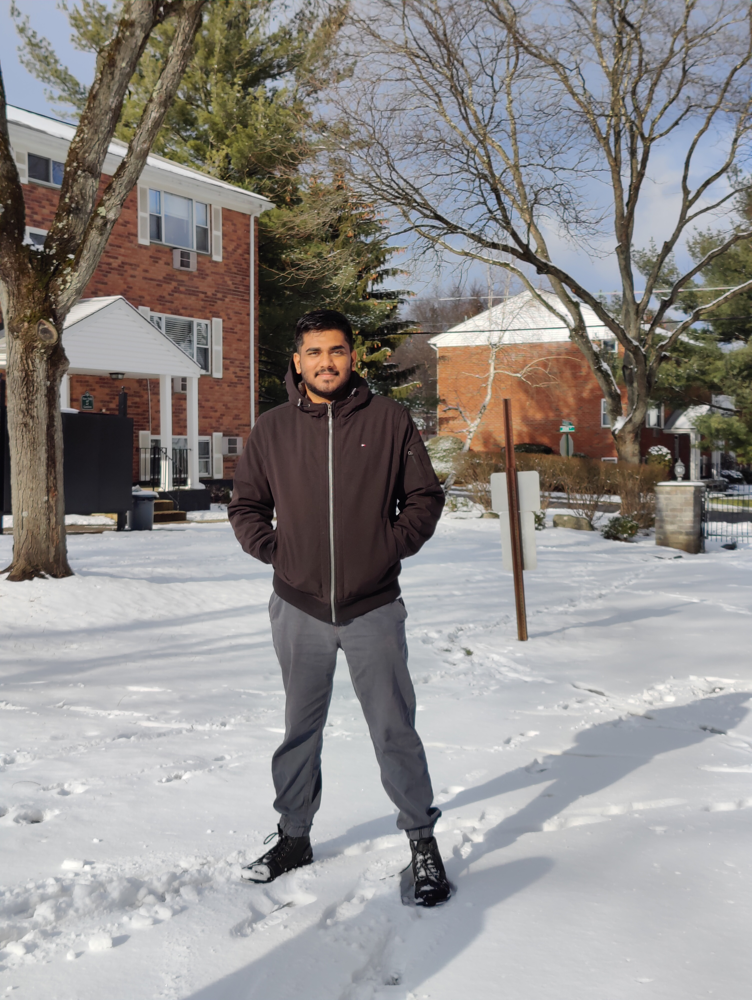

# About me

- Name = Yash Ghatge
- Email  = ghatgey1@newpaltz.edu 
- Contact =  (908)-338-6131
- Address = 20,Colonial dr,Apt C,New Paltz,NY,12561

Hi, this is Yash Ghatge. I am from Maharashtra, India.  I have done my UG in Electronics and Communication Engineering and was introduced to some computer  course like C, C++. I have done projects on Arduino using Embedded C language in my undergrad.  My final project was HUMAN FALL DETECTION. A wearable monitoring device which can accurately  distinguish falls from non-falls of elderly persons and by using existing proven  technologies (GPS, GSM/GPRS), alerts their caregivers. After graduating,  I have worked as Salesforce Developer for 2 years and was involved in multiple  projects which deals with coding and automation was used to build the custom solution  for clients like Mentee and Mentor management including activities, tasks, action plans  within Salesforce. Created various API to connect to a Mobile App to Salesforce etc..

# Course Objective for me 

As I mentioned in above paragraph, I was a salesforce developer and want to pursue in that, further after my masters. I was a backend developer and I want to get known to frontend where HTML,CSS and Java Script comes in picture where I was lacking. Getting in the course will boost my in frontend part and I can design the sites and better UI according to the client requirement and with better knowledge I can try to develop own sites

